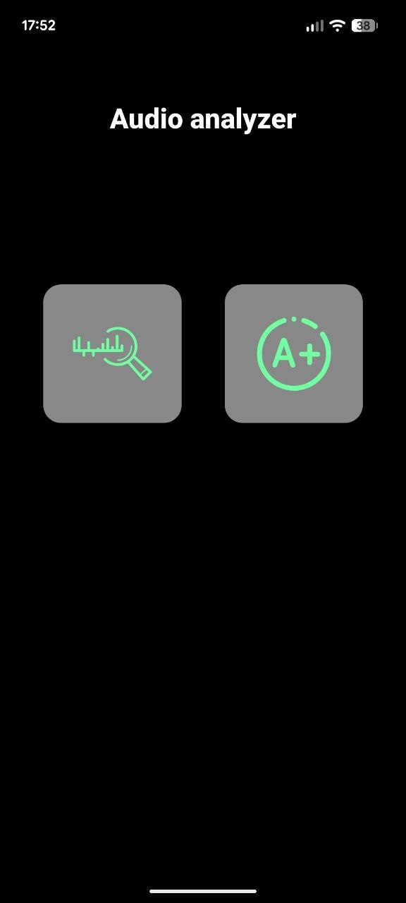
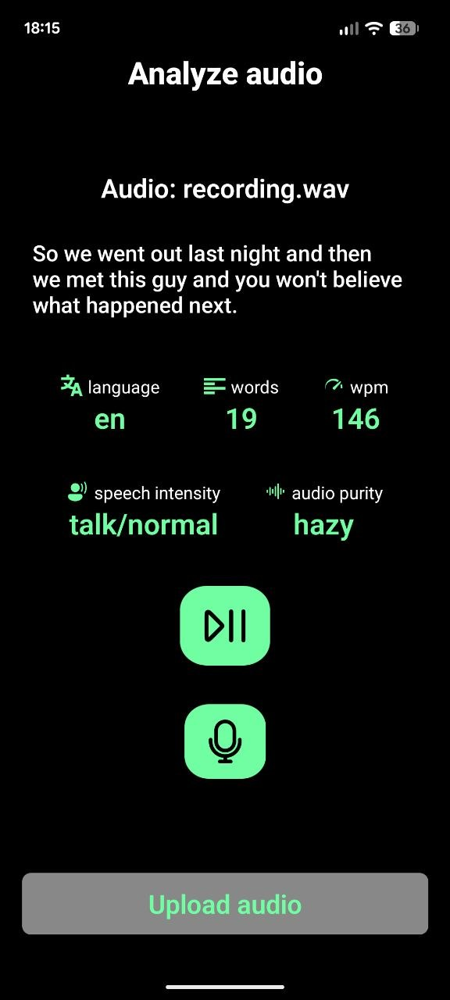
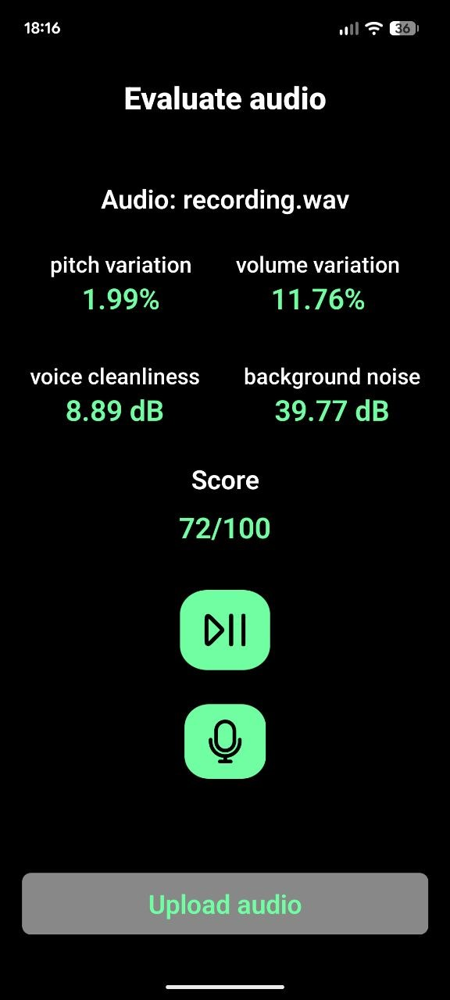

# Voice Analyzer

**Voice Analyzer** is made for analyzing and evaluating human speech audio. It consists of a mobile application built with Expo Go (React Native + TypeScript) and a Python backend API that processes audio, extracts features, and returns analysis results.

## Project Architecture

The project includes two main parts:

### Mobile Application
The mobile app provides the user interface and is written in TypeScript using React Native with Expo Go. It allows users to record or upload audio and view analysis results.

The app contains two main pages:
* **Analyze** – extracts linguistic and speech characteristics
* **Evaluate** – assesses overall audio quality

  
  

On both pages, users can:
* record audio directly from the device microphone
* upload existing audio files
* play back audio after processing
* view metrics returned by the backend

The app communicates with the backend through REST API requests.

### Python Backend
The backend is implemented in Python and contains two endpoints.

* `/analyze` – performs transcription and speech analysis
* `/evaluate` – computes acoustic quality metrics and overall score

---

## Core Processing Modules

### VoiceTranscriber
Used by the `/analyze` endpoint to extract speech and language information. This module uses **OpenAI Whisper** for speech recognition.

It provides:
* Speech transcription
* Language detection
* Word count
* Words per minute (WPM)
* Sound purity classification

### VoiceAnalyzer
Used by the `/evaluate` endpoint to compute acoustic quality metrics from the audio signal using **Praat/Parselmouth**.

It extracts:
* **Jitter** – pitch period variability
* **Shimmer** – amplitude variability
* **HNR** – harmonics-to-noise ratio
* **SNR** – signal-to-noise ratio

An overall audio quality score is calculated from these metrics and returned to the mobile application.

## Technologies Used

**Frontend**
* React Native
* Expo Go
* TypeScript

**Backend**
* Python
* FastAPI / Flask 
* Parselmouth (Praat bindings)
* OpenAI Whisper

## Workflow

1. The user records or uploads an audio file in the mobile app.
2. The file is sent to the Python backend via HTTP request.
3. The backend:
   * converts audio to WAV
   * transcribes speech using Whisper
   * extracts acoustic features using Parselmouth
4. The backend returns structured JSON data.
5. The mobile app displays the results:
   * **Analyze page** shows transcription and speech metrics
   * **Evaluate page** shows acoustic metrics and quality score